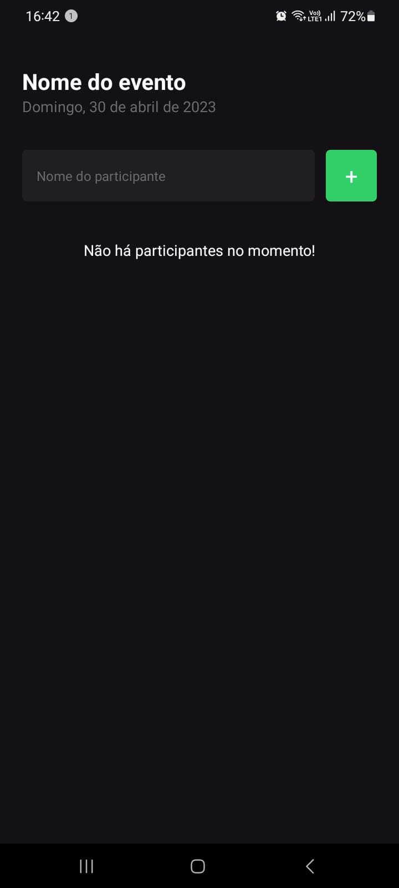
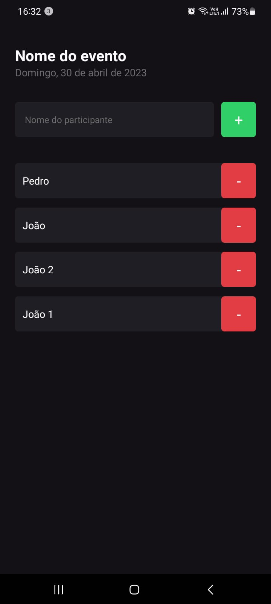
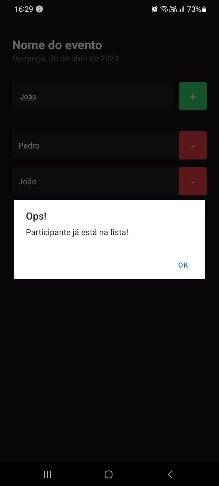

# Projeto ImHere

O Projeto ImHere é minha primeira aplicação mobile. Tem como objetivo gerenciar a lista de participantes de um evento. Desenvolvido com o intuito de aprimorar as habilidades em desenvolvimento mobile, o projeto conta com as seguintes telas e funcionalidades:

## Telas do aplicattivo

## Funcionalidades
- Inserir novo participante na lista;
- Excluir um participante da lista;
- Tratamento para lista vazia, indicando ao usuário que não há participantes cadastrados;
- Verificação de participantes duplicados, impedindo a inserção de dois participantes com o mesmo nome.

## Instalação

Para instalar e executar o projeto, siga as seguintes instruções:

1. Clone o repositório em sua máquina;
2. Abra o terminal e navegue até o diretório raiz do projeto;
3. Instale as dependências necessárias com o comando npm install;
4. Baixe em seu smartphone o aplicativo Expo Go disponível na loja de aplicativos do seu sistema operacional;
5. Inicie o projeto com o comando npm start;
6. Escaneie o código QR gerado no terminal em seu smartphone para abrir a aplicação.

## Uso

Para utilizar o projeto, siga as seguintes instruções:

Abra a aplicação em seu smartphone;
1. Insira o nome do novo participante na caixa de texto e clique em "Adicionar Participante";
2. Para remover um participante, basta clicar no botão vermelho ao lado do nome;
3. Caso não haja participantes cadastrados, uma mensagem informando que a lista está vazia será exibida.

## Tecnologias usadas

- Expo v48.0.15
- React v18.2.0
- React Native V0.71.7
- Typescript v4.9.5
- CSS3

## Autor
Pedro Demeu

## Licença

Este projeto está licenciado sob a Licença MIT - veja o arquivo [LICENSE.md](LICENSE.md) para detalhes.

